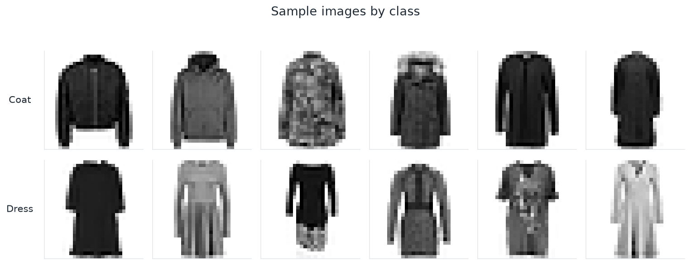
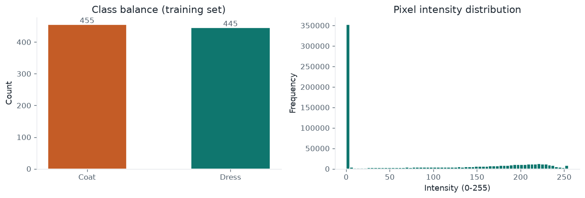
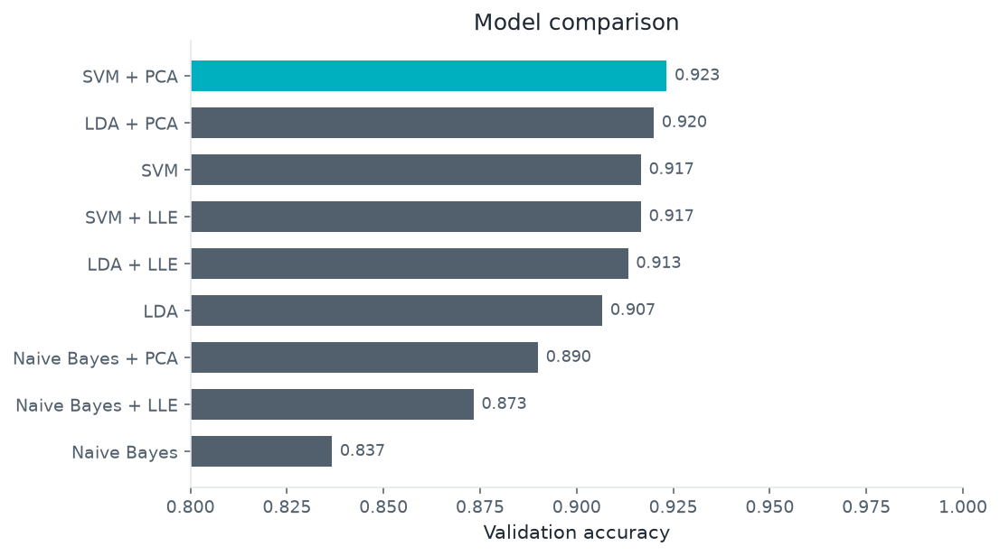
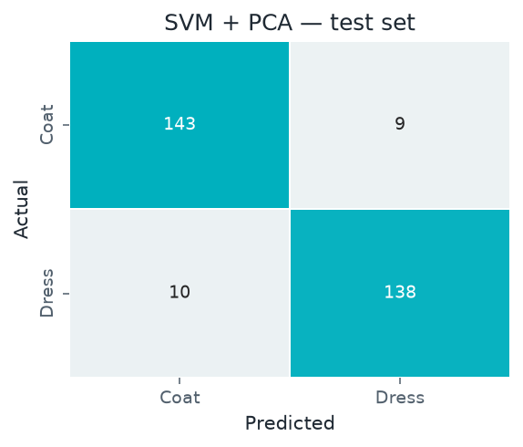

# Fashion Coat vs Dress Classification

Binary classification of Fashion-MNIST clothing images — **coat** vs **dress** — using classical ML with PCA and LLE dimensionality reduction.

**Best pipeline:** SVM + PCA · held-out test accuracy ≈ **93–94%** (validation typically highest among the nine model combinations).



## Problem

Given 28×28 grayscale pixels (784 features), predict whether an image shows a coat or a dress. The high dimensionality makes feature compression a core part of the solution, not just a preprocessing detail.

## Dataset

| File | Role |
|------|------|
| [`data/raw/train.csv`](data/raw/train.csv) | Labeled images (`label` + 784 pixels), split into train / validation / test |

Source: [Fashion-MNIST](https://www.kaggle.com/datasets/zalando-research/fashionmnist) subset (coat / dress).



## Approach

1. Stratified **60 / 20 / 20** train / validation / test split  
2. Baseline models: **SVM**, **Gaussian Naive Bayes**, **LDA**  
3. Dimensionality reduction: **PCA** and **LLE**, jointly tuned with model hyperparameters  
4. Select the best pipeline on validation accuracy; report once on the held-out test set  



## Key results

- Full-pixel SVM overfits; **PCA reduces the train/validation gap** and improves validation accuracy.
- **Naive Bayes** needs strong compression (low PCA rank) because pixel features are highly dependent.
- **LLE** is competitive but slower and did not beat PCA for SVM on this dataset.
- Final test confusion matrix for the selected SVM + PCA pipeline:



Full narrative, tuning details, and additional plots live in the notebook:

[`notebooks/fashion_coat_dress_classification.ipynb`](notebooks/fashion_coat_dress_classification.ipynb)

## How to run

From the repository root (recommended):

```bash
python3 -m venv .venv
source .venv/bin/activate          # Windows: .venv\Scripts\activate
pip install -r requirements.txt
pip install -r projects/fashion-coat-dress-classification/requirements.txt
python -m ipykernel install --user --name=ml-portfolio --display-name="Python 3 (.venv)"
jupyter lab
```

Then open `projects/fashion-coat-dress-classification/notebooks/fashion_coat_dress_classification.ipynb` and select the **Python 3 (.venv)** kernel.

Hyperparameter sweeps (especially LLE) can take a while; run all cells top to bottom.

## Project layout

```
fashion-coat-dress-classification/
├── README.md
├── requirements.txt
├── notebooks/
│   └── fashion_coat_dress_classification.ipynb
├── data/raw/
│   └── train.csv
└── reports/figures/
```
