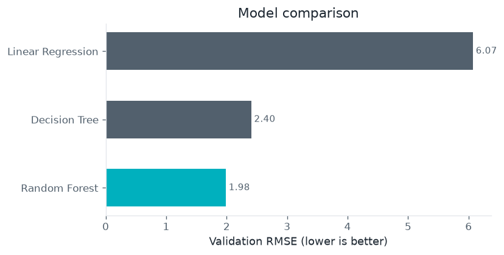
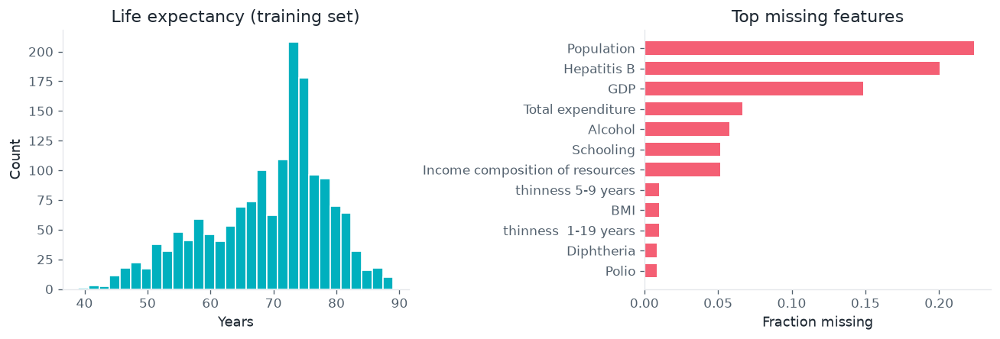
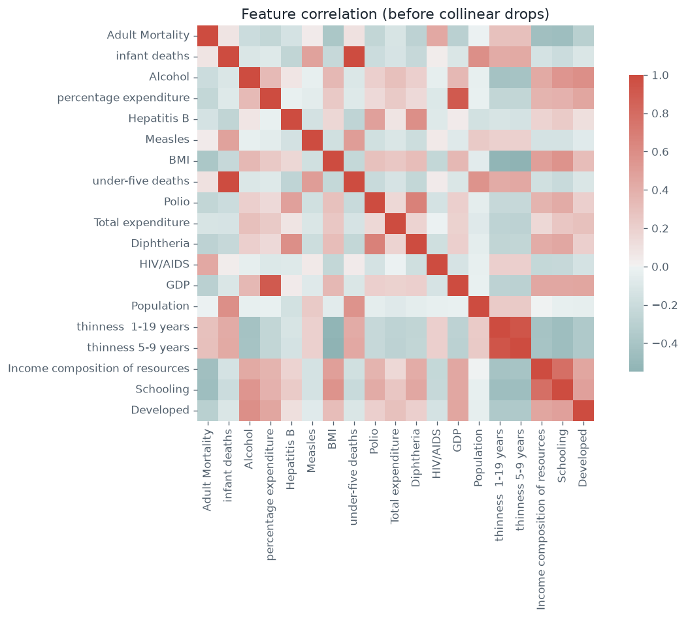
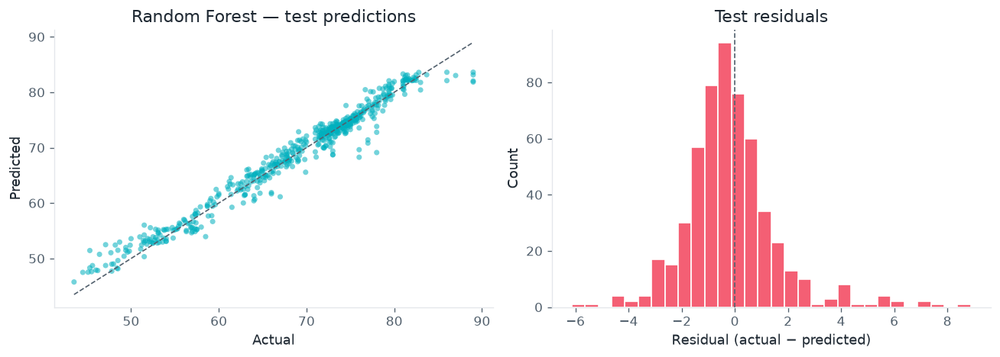

# Life Expectancy Regression

Predict country-level **life expectancy** from health, demographic, and socio-economic indicators — comparing a from-scratch **Random Forest**, **Linear Regression**, and a tuned **Decision Tree**.

**Selected model:** Custom Random Forest · validation RMSE ≈ **1.98** · held-out test RMSE ≈ **1.75**



## Problem

Given WHO-style features (immunization coverage, GDP, schooling proxies, adult/infant mortality, BMI, HIV prevalence, …), predict continuous `Life expectancy` in years. The goal is a readable classical-ML baseline with clear preprocessing and hyperparameter selection on a validation split.

## Dataset

| File | Role |
|------|------|
| [`data/raw/data.csv`](data/raw/data.csv) | Labeled country/year rows; split into train / validation / test |



## Approach

1. **60 / 20 / 20** train / validation / test split  
2. Encode `Status` → `Developed`; drop `Country` / `Year` and near-collinear features; sentinel-impute missing values  
3. Tune a **custom bagged Random Forest** (bootstrap samples of `DecisionTreeRegressor`) and a **Decision Tree**; fit **Linear Regression** as a linear baseline  
4. Select by validation RMSE; evaluate once on the held-out test set  



## Key results

- Adult mortality, HIV prevalence, and related health indicators dominate the signal; a linear model underfits relative to trees.
- The from-scratch forest (best settings: depth 15, 150 trees, 800 bootstrap samples) leads validation RMSE among the three models.
- Held-out test diagnostics for the selected forest:



Full narrative and tuning details:

[`notebooks/life_expectancy_regression.ipynb`](notebooks/life_expectancy_regression.ipynb)

## How to run

From the repository root:

```bash
python3 -m venv .venv
source .venv/bin/activate          # Windows: .venv\Scripts\activate
pip install -r requirements.txt
pip install -r projects/life-expectancy-regression/requirements.txt
jupyter lab
```

Open `projects/life-expectancy-regression/notebooks/life_expectancy_regression.ipynb` with the **Python 3 (.venv)** kernel. Charts use [`common/portfolio_style.py`](../../common/portfolio_style.py).

## Project layout

```
life-expectancy-regression/
├── README.md
├── requirements.txt
├── notebooks/
│   └── life_expectancy_regression.ipynb
├── data/raw/
│   └── data.csv
└── reports/figures/
```
