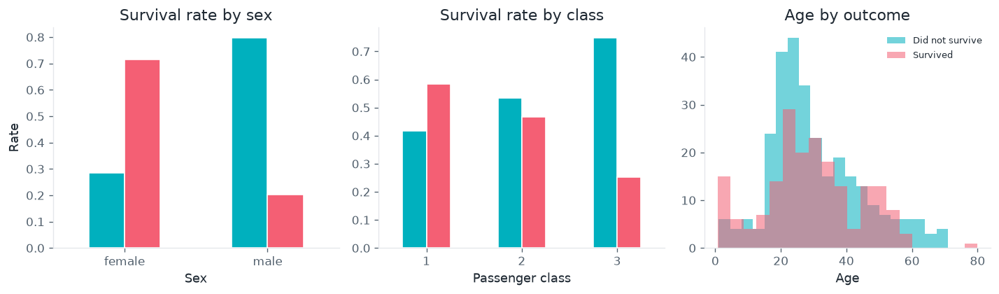
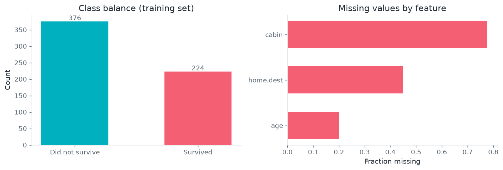
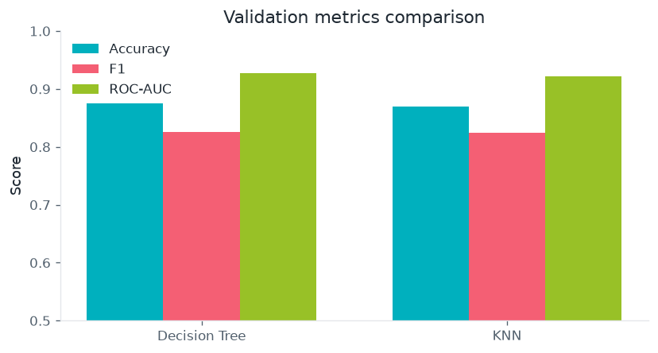
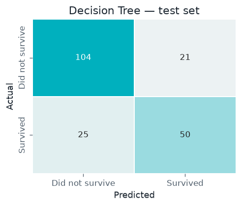

# Titanic Survival Classification

Predict whether a passenger survived using tabular features and classical machine learning — comparing a tuned **Decision Tree** with **k-Nearest Neighbors**.

**Selected model:** Decision Tree · validation F1 ≈ **0.83** · held-out test accuracy ≈ **77%**



## Problem

Given passenger attributes (class, sex, age, fare, family counts, …), predict the binary outcome `survived`. The label is imbalanced (~37% survival in training), so F1 and ROC-AUC complement accuracy when choosing models.

## Dataset

| File | Role |
|------|------|
| [`data/raw/data.csv`](data/raw/data.csv) | Labeled passengers; split into train / validation / test |



## Approach

1. Stratified **60 / 20 / 20** train / validation / test split  
2. Drop high-cardinality text fields; encode `sex`; impute remaining missing values  
3. Tune a **Decision Tree** and **KNN** (with standardized features) on validation accuracy  
4. Compare accuracy, F1, and ROC-AUC; evaluate the selected model once on the test set  



## Key results

- Sex and passenger class are strong univariate signals for survival.
- Decision Tree and KNN reach similar validation scores; the tree wins slightly on F1.
- Held-out test performance for the selected Decision Tree:



Full narrative and tuning details:

[`notebooks/titanic_survival_classification.ipynb`](notebooks/titanic_survival_classification.ipynb)

## How to run

From the repository root:

```bash
python3 -m venv .venv
source .venv/bin/activate          # Windows: .venv\Scripts\activate
pip install -r requirements.txt
pip install -r projects/titanic-survival-classification/requirements.txt
jupyter lab
```

Open `projects/titanic-survival-classification/notebooks/titanic_survival_classification.ipynb` with the **Python 3 (.venv)** kernel. Charts use [`common/portfolio_style.py`](../../common/portfolio_style.py).

## Project layout

```
titanic-survival-classification/
├── README.md
├── requirements.txt
├── notebooks/
│   └── titanic_survival_classification.ipynb
├── data/raw/
│   └── data.csv
└── reports/figures/
```
